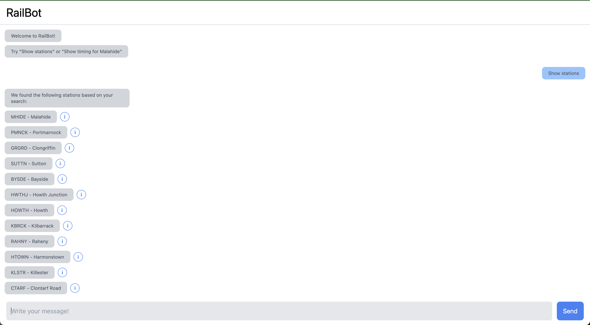

# Unflow case study

Unflow assignment that lets the user:
- responds to requests for DART train times with the next 2 trains at a selected station
- allows users to request a list of possible stations (this can be a subset of total possible stations if that's easier)
- responds to all other requests with "Sorry, I don't know how to answer that"

## How to setup and run the project
1. Clone the repo
2. Install dependencies with `npm install`
3. Run the project with `npm run dev`
4. Open the url `http://localhost:3000` in the browser to test the project

## General assumptions
1. I used the container pattern for the frontend where the index page is responsible for all the orchestration
2. I used the built-in NextJs API routes to circumvent the CORS issue
3. Instead of relying on NLU, I went with hardcoded search to keep the project simple. Ex "Show stations"